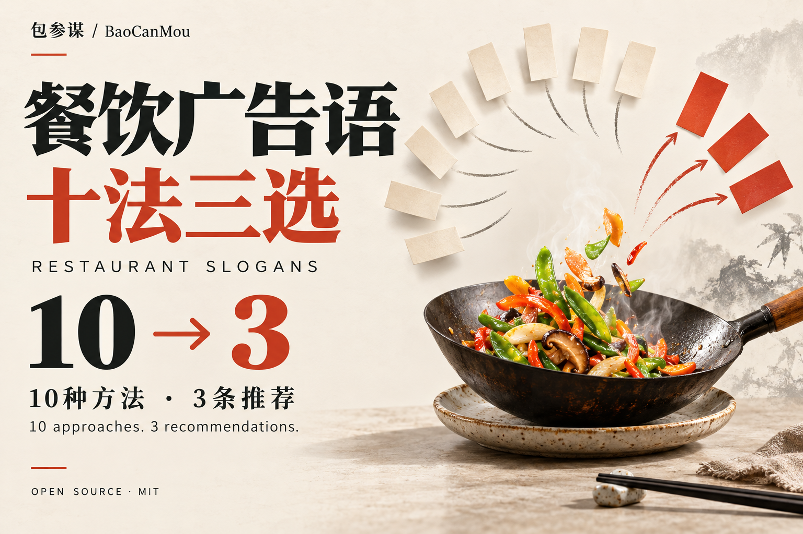
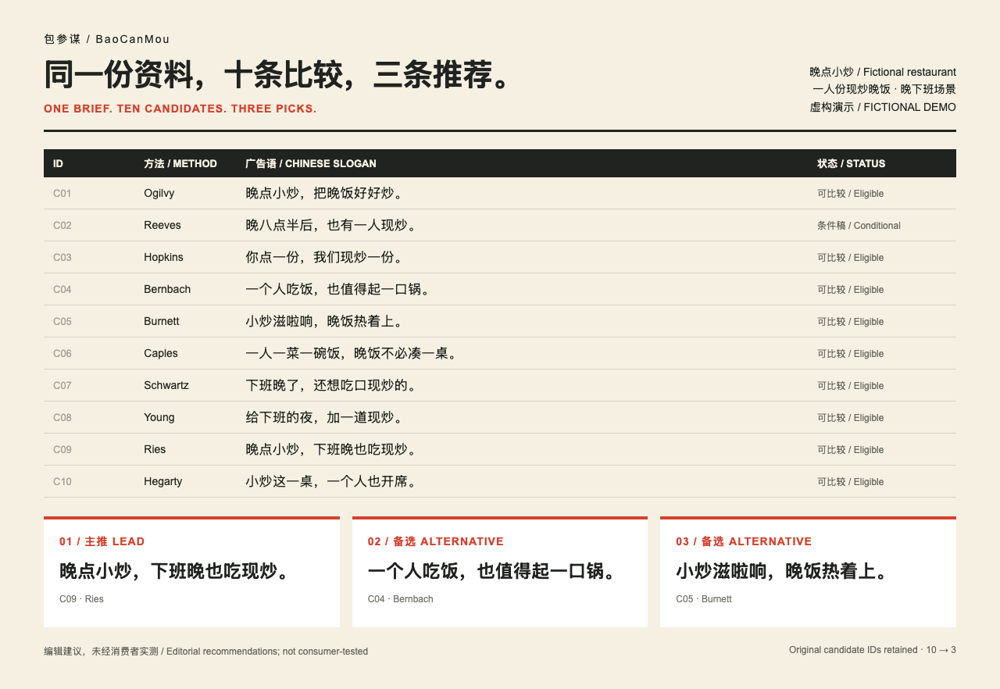

# BaoCanMou Restaurant Slogans: Ten Approaches, Three Picks

**English** · [中文](README.md) · [Downloads](https://github.com/yht0912/baocanmou-restaurant-slogan/releases) · [BaoCanMou](https://www.bcmsj.com)



**One restaurant brief. One original slogan per approach. Ten candidates compared, three recommended.**

An open-source AI Skill for restaurant strategists, designers and operators. It connects source-based advertising principles to food, dining occasions and promises a business can actually deliver. Chinese and English instructions, examples, citations and optional structural checks are included.

## See the output

Fictional example: **Late Wok**, a restaurant serving individually stir-fried dinners to people eating alone after a late shift. The task is a lasting menu-front and in-store brand message.

| Choice | Slogan | Why consider it? |
|---|---|---|
| Lead | **Late Wok. Late shifts, freshly stir-fried dinners.** | Names the brand, occasion and food preparation |
| Alternative | **Dinner for one still deserves a wok.** | Connects individual portions to the human situation |
| Sensory angle | **Hear the sizzle. Dinner arrives hot.** | Makes the actual cooking and dine-in experience tangible |

These are editorial English adaptations of a fictional Chinese example, not claims of native-market consumer validation. Operating hours, brand/category pairing and dine-in restrictions are part of the recommendation.

[Full English example: all ten and the comparison](examples/late-wok.en.md) · [Chinese stir-fry example](skills/baocanmou-restaurant-slogan/examples/晚点小炒-十法三选.md) · [Independent Chinese tea-shop trial](skills/baocanmou-restaurant-slogan/examples/青间茶-十法三选.md)

## Start in three steps

1. [Download the latest release](https://github.com/yht0912/baocanmou-restaurant-slogan/releases/latest), choosing `baocanmou-restaurant-slogan-skill-v1.1.1.zip`, or clone this repository.
2. Install the complete Skill folder in your assistant’s skills directory. See the [bilingual installation guide](docs/INSTALL.md).
3. Start a new conversation and supply your brief:

```text
Use $baocanmou-restaurant-slogan.
Brand: …
Restaurant category and main products: …
Customers and dining occasion: …
Facts we can support: …
Where this line will appear: …
Write one slogan for each of the ten approaches. Compare the ten,
recommend three, and explain the lead choice. Write in English for … market.
```

You can paste existing material instead of filling a form. If critical facts are missing, the Skill identifies the condition instead of inventing it. [Input and output requirements](docs/USAGE.md)

## Built around restaurants

- **A specific meal choice:** product, customer, occasion, dine-in or delivery, and a credible reason to choose.
- **Operationally supportable copy:** cooked to order does not automatically mean never frozen; optional added sugar does not mean sugar-free; freshly cooked texture is not a delivery guarantee.
- **The requested use:** a short promotion is not automatically suitable as a lasting brand line.
- **Visible prerequisites:** theory applicability, restaurant facts and medium conditions are checked separately.
- **A shared comparison:** clarity, appetite/visit motivation, recall, brand linkage and medium fit. These are editorial judgments, not measured conversion rates.

The checks cover quick meals, noodles, full-service dining, hotpot, grilling, tea, coffee, bakery, cold food, delivery and multi-location operations. The scope stays on restaurant slogans.

## Ten source-based approaches

| Author | Core principle applied in this project |
|---|---|
| David Ogilvy | Brand image |
| Rosser Reeves | Unique Selling Proposition |
| Claude Hopkins | Specific facts and testing |
| Bill Bernbach | Human-centered originality |
| Leo Burnett | Inherent product drama |
| John Caples | Direct headlines and response testing |
| Eugene Schwartz | Existing desire and audience awareness |
| James Webb Young | New combinations of existing elements |
| Al Ries | Positioning and focus; Jack Trout’s coauthorship retained |
| John Hegarty | Relevant difference and questioning convention |

[English method cards and sources](skills/baocanmou-restaurant-slogan/references/masters.en.md) · [Chinese cards](skills/baocanmou-restaurant-slogan/references/masters.md) · [Source evidence levels](skills/baocanmou-restaurant-slogan/references/sources.json)

This is a project selection, not a global ranking. Each candidate applies a documented core principle, not the author’s entire body of work. Authorial ideas, BaoCanMou’s restaurant adaptations and editorial selection rules are distinguished. There is no endorsement, impersonation or claim that every complete original book was reviewed.

## Chinese, English and the BaoCanMou framework

The Skill follows the requested creative language. English copy is adapted for its audience rather than translated word for word. Bilingual variants keep the same facts, method and candidate identity; they do not count as extra candidates.

When the user already supplies a **Mou–Shu–Ming** positioning brief, the workflow carries it forward: values constrain promises; positioning defines the customer and reason to choose; expression gives the promise a form; communication defines the touchpoint and feedback. This integration note does not relicense BaoCanMou’s pre-existing proprietary framework or relabel the ten authors’ theories as BaoCanMou inventions.

## Visuals and requirements



[Bilingual cover](assets/cover-bilingual.png) · [Portrait announcement](assets/social-poster-bilingual.png) · [Workflow diagram](assets/workflow.svg) · [Media kit, credit and image guidance](docs/MEDIA-KIT.md)

The food visuals are AI-assisted promotional illustrations. The example preview is a layout of actual sample content, not a screenshot of an assistant UI. No author portraits, publisher logos or client photography are bundled.

| Component | Requirement or status |
|---|---|
| Creative use | An AI assistant able to read Agent Skills or the supplied documents |
| Python | Not needed for writing; Python 3.10+ standard library for optional installation/check scripts |
| Network/cost | No bundled API keys, telemetry, network calls, MCP services or publishing automation; your host’s policies and fees still apply |
| Checks | 13 delivery and 3 installer regression tests, plus structure checks on Chinese and English examples |
| Codex plugin | `.codex-plugin/plugin.json` included; publication on GitHub is not official marketplace listing |

```bash
python3 scripts/verify_release.py
python3 -B -m unittest discover -s skills/baocanmou-restaurant-slogan/tests -v
python3 -B -m unittest discover -s scripts -p "test_*.py" -v
```

Passing checks confirms structure and consistency, not creative excellence, legal clearance or sales impact. [Validation scope](docs/VALIDATION.md) · [Privacy](PRIVACY.md)

## Credit, license and contributions

**Publisher: BaoCanMou / 包参谋. Concept and product direction: Yi Huiting / 易慧庭.** Workflow, code, documentation and visuals were produced under BaoCanMou’s direction with AI assistance.

Newly authored code, workflow and documentation are distributed under the [MIT License](LICENSE). Preserve the copyright and license notice when redistributing copies or substantial portions. Visible project credit in tutorials or derivative tools is welcome; there is no extra MIT condition requiring BaoCanMou’s name on generated restaurant slogans.

[Attribution guide](docs/ATTRIBUTION.md) · [Third-party and asset notice](NOTICE.md) · [Contributing](CONTRIBUTING.md) · [Issues](https://github.com/yht0912/baocanmou-restaurant-slogan/issues) · [Changelog](CHANGELOG.md)

Suggested citation: **BaoCanMou. Restaurant Slogans: Ten Approaches, Three Picks. Version 1.1.1, 2026.** Machine-readable citation: [CITATION.cff](CITATION.cff).

---

**BaoCanMou — Design advice grounded in business.**  
Positioning first, design second. Understand why customers choose you, then express that reason through identity, packaging, brand environments and communication. [Visit BaoCanMou](https://www.bcmsj.com)
