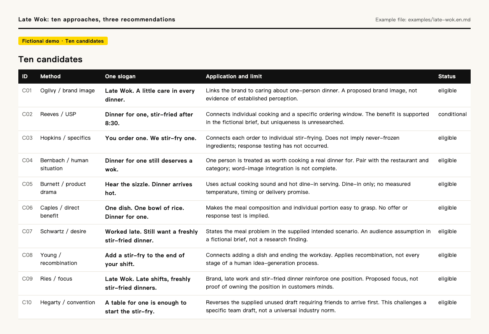
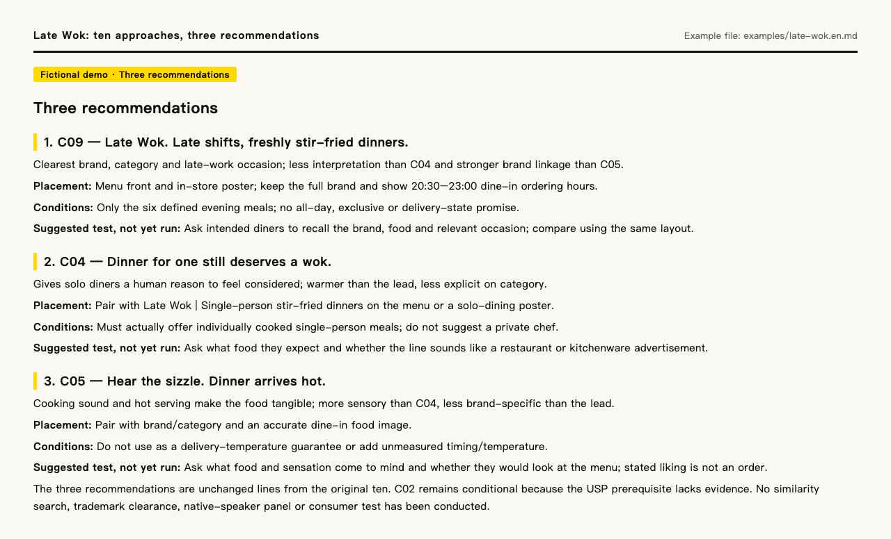
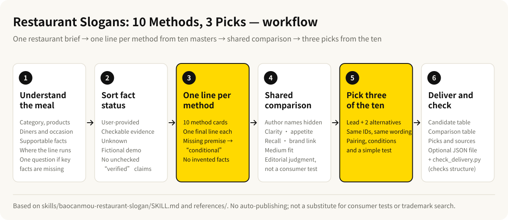

# BaoCanMou Restaurant Slogans: 10 Methods, 3 Picks


[中文](README.md) · **English**

[](CHANGELOG.md)
[](LICENSE)
[](https://github.com/baocanmou/baocanmou-restaurant-slogan/actions/workflows/validate.yml)
[](https://gitee.com/baocanmou/baocanmou-restaurant-slogan)

An AI Skill for restaurant strategists, designers and operators: give it one restaurant brief, and it writes one slogan for each of ten core methods from advertising and positioning masters, compares the ten on a shared standard, recommends three of them, and states the basis and conditions of use for each.

## Who it is for, and when

- **A new or refreshed restaurant needs a lasting slogan** for the menu front, in-store posters, packaging or a delivery storefront, and you want candidates from different angles before choosing.
- **Your team has several drafts and cannot decide.** Hand over the drafts with the business facts; the Skill compares them on one standard and explains the choice.
- **You need sourced candidates before a client presentation.** Every line names the author and the core principle it applies, so the reasoning is easy to present.
- **You need Chinese and English versions.** English copy is adapted for the target market rather than translated word for word.

It covers quick meals, noodles, full-service dining, hotpot, grilling, coffee, tea, bakery, cold food, delivery and multi-location operations.

## What it does

- **Starts with the meal:** what is sold, who eats it, when, dine-in or delivery, and where the line will appear. If key facts are all missing, it asks one short question.
- **Sorts fact status:** user-provided, checkable, unknown and fictional facts are labeled separately; nothing unchecked is called "verified".
- **Writes one line per method:** each author gets exactly one final slogan, and the ten vary in purchase motive or creative mechanism.
- **Marks missing prerequisites as "conditional":** for example, a USP line without competitor evidence stays among the ten but cannot become a complete recommendation.
- **Compares on one standard:** with author names hidden, it rates clarity, appetite/visit motivation, recall, brand linkage and medium fit as strong/medium/weak editorial judgments.
- **Picks three of the ten:** a lead and two alternatives, keeping their original IDs and wording, with pairing, operational conditions and a simple test for each.
- **Optional structure check:** save the result as `delivery.json` and run the bundled script to confirm ten lines, ten authors, three picks and matching sources.

## Example output

The screenshots below come straight from the repository's fictional example, Late Wok: individually stir-fried dinners for people eating alone after a late shift, with the line intended for the menu front and in-store posters. Brand and business facts are fictional; there is no real client or sales result. The English version is an editorial adaptation of the Chinese example.





Full files: [Late Wok: all ten and the comparison](examples/late-wok.en.md) · [Chinese stir-fry example](skills/baocanmou-restaurant-slogan/examples/晚点小炒-十法三选.md) · [Chinese tea-shop trial by another AI](skills/baocanmou-restaurant-slogan/examples/青间茶-十法三选.md)

## Workflow



### Ten masters, ten methods

| Author | Core principle applied in this project |
|---|---|
| David Ogilvy | Brand image |
| Rosser Reeves | Unique Selling Proposition |
| Claude Hopkins | Specific facts and testing |
| Bill Bernbach | Human-centered originality |
| Leo Burnett | Inherent product drama |
| John Caples | Direct headlines and response testing |
| Eugene Schwartz | Existing desire and audience awareness |
| James Webb Young | New combinations of existing elements |
| Al Ries | Positioning and focus; Jack Trout's coauthorship retained |
| John Hegarty | Relevant difference and questioning convention |

These ten are the project's selection, not a ranking. Each line applies one documented core principle, not the author's entire body of work, and implies no involvement or endorsement by the author. [English method cards and sources](skills/baocanmou-restaurant-slogan/references/masters.en.md) · [Chinese cards](skills/baocanmou-restaurant-slogan/references/masters.md) · [Source evidence levels](skills/baocanmou-restaurant-slogan/references/sources.json)

## Installation

**Option 1: download a release and install by hand (no Python needed)**

1. Download `baocanmou-restaurant-slogan-skill-v1.1.1.zip` from [Releases](https://github.com/baocanmou/baocanmou-restaurant-slogan/releases/latest).
2. Extract it, find the folder that directly contains `SKILL.md`, and copy that whole folder into your host's skills directory, keeping `references/`, `scripts/` and `examples/`:

| Host | User-level destination |
|---|---|
| Codex | `~/.agents/skills/baocanmou-restaurant-slogan/` |
| Claude Code | `~/.claude/skills/baocanmou-restaurant-slogan/` |
| Other Agent Skills hosts | Follow that host's current documentation |

**Option 2: clone and use the installer**

```bash
git clone https://github.com/baocanmou/baocanmou-restaurant-slogan.git
cd baocanmou-restaurant-slogan
python3 scripts/install_skill.py --host codex --dry-run
python3 scripts/install_skill.py --host codex
```

For Claude Code, replace `codex` with `claude`. The installer is local-only and copies just this Skill. It stops if the destination exists; add `--replace` to upgrade; the old version is backed up to `skill-backups/`, outside the skills discovery directory, before it is replaced.

In mainland China, you can clone from the Gitee mirror instead; the remaining steps are the same:

```bash
git clone https://gitee.com/baocanmou/baocanmou-restaurant-slogan.git
```

Start a new conversation after installing. See [docs/INSTALL.md](docs/INSTALL.md) for Codex plugin packaging and uninstalling.

## Usage

Invoke `$baocanmou-restaurant-slogan`, or ask for "Restaurant Slogans: 10 Methods, 3 Picks". You can paste existing material instead of filling in a form.

```text
Use $baocanmou-restaurant-slogan.
Brand: …
Restaurant category and main products: …
Customers and dining occasion: …
Facts we can support: …
Where this line will appear: …
Write one slogan for each of the ten approaches. Compare the ten,
recommend three, and explain the lead choice. Write in English for … market.
```

```text
Use $baocanmou-restaurant-slogan to compare these existing drafts: …
Restaurant facts: …
We need a lasting menu-front brand line, not a price promotion.
```

```text
使用 $baocanmou-restaurant-slogan。
店名：……；品类与主打产品：……；主要顾客与用餐场景：……。
能够确认的特点：……；这句话用于：……。
按 10 位名家的方法各写 1 条广告语，比较后推荐 3 条，说明主推理由。
```

Output order: brief summary → ten candidates → shared comparison → three recommendations → sources. See [docs/USAGE.md](docs/USAGE.md) for input and output requirements.

## Limits

- It writes restaurant slogans and does not expand into a full brand strategy. When a lasting brand line is requested, short-term promotions are not used to fill the three picks.
- It does not invent ingredient origins, cooking processes, health benefits, heritage claims, customer reviews, chain size or offers. "Cooked to order" does not mean never frozen, and freshly cooked texture is not a delivery promise.
- Strong/medium/weak ratings are editorial judgments, not consumer experiments. There are no simulated expert votes, win rates or sales forecasts.
- It does not publish, contact anyone, replace operational checks or perform trademark clearance. Before real use, a person needs to confirm the business facts, local food and advertising requirements, similarity to existing wording and registrability.
- A public similarity search sends unpublished wording to a search provider; get permission beforehand.
- The project has no server, API key, telemetry or upload feature; your input is handled under your AI assistant's own data policy. See [PRIVACY.md](PRIVACY.md).

## FAQ

**Do I need Python?**
Not for writing slogans. The optional installer and structure check need nothing beyond the Python 3.10+ standard library.

**Were these slogans written or endorsed by the ten masters?**
No. The Skill applies one documented core principle per author to new work. It does not impersonate the authors or imply their involvement, endorsement or authorization.

**Can it write in English?**
Yes. It follows the user's language. English copy is adapted for the target market; bilingual delivery keeps the same method, facts and IDs, and a translation does not count as an extra candidate. No native-English consumer testing has been done.

**Can I use it with an incomplete brief?**
Yes. The Skill states the missing conditions and labels the work as concept or conditional. Candidates missing critical prerequisites are excluded from complete recommendations.

**If the structure check passes, is the copy good?**
No. The check confirms counts, authors, IDs, status and sources line up. It does not judge creative quality, similarity or registrability. See [docs/VALIDATION.md](docs/VALIDATION.md).

## Version and updates

Current version: **v1.1.1** (2026-09-11). See [CHANGELOG.md](CHANGELOG.md) for changes and [Releases](https://github.com/baocanmou/baocanmou-restaurant-slogan/releases) for packages.

Repository checks (same as CI):

```bash
python3 scripts/verify_release.py
python3 -B -m unittest discover -s skills/baocanmou-restaurant-slogan/tests -v
python3 -B -m unittest discover -s scripts -p "test_*.py" -v
```

## License and credit

**Publisher: BaoCanMou / 包参谋. Concept and product direction: Yi Huiting / 易慧庭.** Workflow, code, documentation and visuals were produced by BaoCanMou.

Newly authored code, workflow and documentation are distributed under the [MIT License](LICENSE). Preserve the copyright and license notice when redistributing copies or substantial portions. MIT does not require a BaoCanMou credit on every newly generated slogan.

The ten authors' theories belong to their authors; the method cards are brief paraphrases based on source research. An existing Mou–Shu–Ming positioning brief can be carried forward as input; BaoCanMou's pre-existing Mou–Shu–Ming framework is not newly licensed by this package. Late Wok and the Chinese stir-fry and tea-shop examples are fictional. See [NOTICE.md](NOTICE.md) and the [attribution guide](docs/ATTRIBUTION.md).

Suggested citation: **BaoCanMou. Restaurant Slogans: Ten Approaches, Three Picks. Version 1.1.1, 2026.** Machine-readable citation: [CITATION.cff](CITATION.cff). [Contributing](CONTRIBUTING.md) · [Issues](https://github.com/baocanmou/baocanmou-restaurant-slogan/issues) · [Media kit](docs/MEDIA-KIT.md)

## Other BaoCanMou open-source projects

| Project | What it does | China mirror |
|---|---|---|
| [Plans into Presentations](https://github.com/baocanmou/baocanmou-plan-to-ppt) | Turns briefs and research into an editable, source-checked proposal deck | [Gitee](https://gitee.com/baocanmou/baocanmou-plan-to-ppt) |
| [BCM GEO Outcome Engine](https://github.com/baocanmou/bcm-geo-optimizer) | Diagnoses brand mentions, citations and recommendations in AI search | [Gitee](https://gitee.com/baocanmou/bcm-geo-optimizer) |
| [Open GEO SEO Console](https://github.com/baocanmou/open-geo-seo-console) | Self-hosted SEO and GEO monitoring console | [Gitee](https://gitee.com/baocanmou/open-geo-seo-console) |
| [BaoCanMou AI Skill Center](https://github.com/baocanmou/baocanmou-ai-skill-center) | Desktop app that catalogs local AI skills and links them to AI tools | [Gitee](https://gitee.com/baocanmou/baocanmou-ai-skill-center) |

## About BaoCanMou

BaoCanMou (包参谋) — Nanchang BaoCanMou Brand Planning Co., Ltd. — is a brand strategy and design company founded in 2012 in Nanchang, Jiangxi, China. We provide brand positioning, logo and visual identity, packaging, brand space and communication content, mainly for restaurants, chain stores, packaged food and regional specialty brands. Founder: Yi Huiting. Website: [www.bcmsj.com](https://www.bcmsj.com).

We work positioning first, design second. These tools come from work we repeat in client projects; we write the judgment criteria down so AI can follow the same standard.
