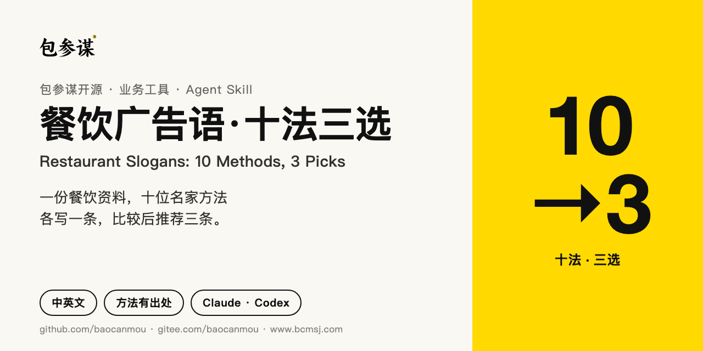
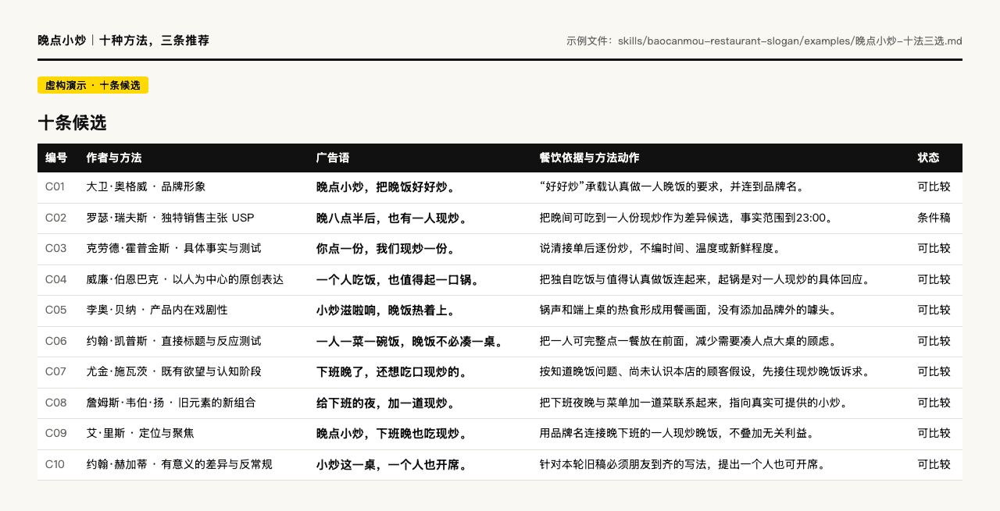
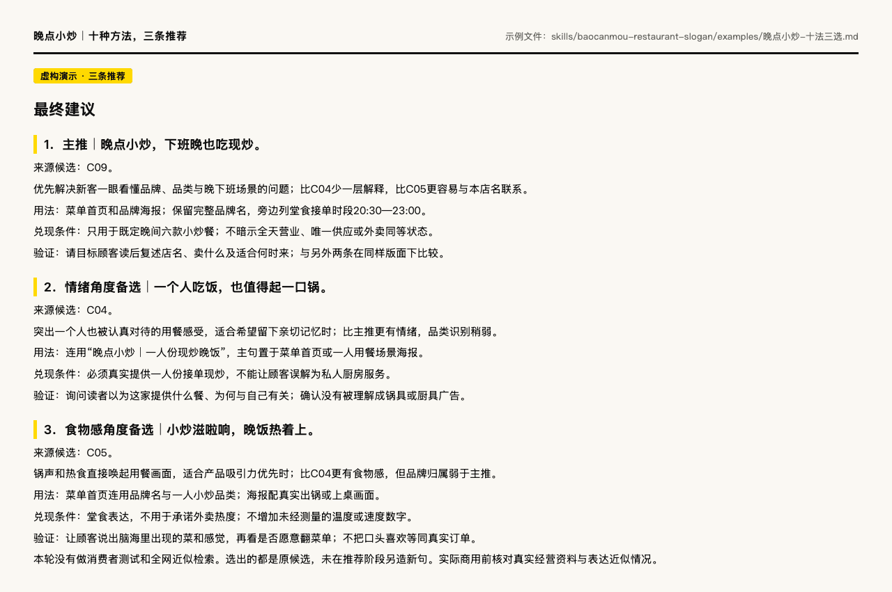
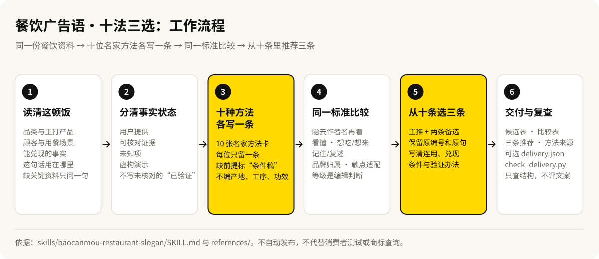

# 包参谋·餐饮广告语：十法三选



**中文** · [English](README.en.md)

[](CHANGELOG.md)
[](LICENSE)
[](https://github.com/baocanmou/baocanmou-restaurant-slogan/actions/workflows/validate.yml)
[](https://gitee.com/baocanmou/baocanmou-restaurant-slogan)

给餐饮策划、设计师和经营者用的 AI Skill：把一家餐饮店的资料，按 10 位广告与定位名家的核心方法各写 1 条广告语，统一比较后从这十条里推荐 3 条，并写清每条的依据和使用条件。

## 适合谁、什么时候用

- **新店或改版要定长期广告语**：放在菜单首页、店内海报、包装或外卖店铺上，想先看到不同思路的候选，再做取舍。
- **团队手里已有几条旧稿，拿不定主意**：把旧稿和经营资料一起交给它，用同一套标准比较，说清选哪条、为什么。
- **给客户提案前需要有出处的候选**：每条都标明采用了哪位作者的哪个核心观点，方便讲清思路来源。
- **需要中英文两个版本**：英文按目标市场重新组织表达，不逐字翻译。

适用小炒快餐、粉面、正餐、火锅烧烤、咖啡茶饮、烘焙甜品、冷食、外卖和连锁餐饮。

## 能做什么

- **先读清这顿饭**：卖什么、谁来吃、什么时候吃、堂食还是外卖、这句话放在哪里；关键资料全缺时只问一个简短问题。
- **分清事实状态**：用户提供、可核对、未知、虚构演示分开标注，没有核对过的不写“已验证”。
- **十种方法各写一条**：每位作者只留一条最终广告语，十条要有不同的购买动机或表达方式。
- **缺前提就标“条件稿”**：例如 USP 缺少竞争调查时，保留在十条里，但不进入可用推荐。
- **统一比较**：隐去作者名，按看懂、想吃/想来、记住/复述、品牌归属、触点适配五项给出强/中/弱的编辑判断。
- **从十条选三条**：主推加两条备选，保留原编号和原句，写清连用方式、兑现条件和简单验证办法。
- **可选结构检查**：把结果存成 `delivery.json`，用随包脚本检查 10 条、10 位作者、3 条推荐和来源是否对得上。

## 效果示例

以下截图直接取自仓库里的虚构示范「晚点小炒」：面向下班晚、一个人吃饭的顾客，提供一人份现炒晚饭，广告语用于菜单首页与店内海报。品牌与经营资料均为虚构，没有真实客户或销量成绩。





完整文件：[晚点小炒：十条候选与比较](skills/baocanmou-restaurant-slogan/examples/晚点小炒-十法三选.md) · [青间茶：另一 AI 独立试用](skills/baocanmou-restaurant-slogan/examples/青间茶-十法三选.md) · [Late Wok 英文示范](examples/late-wok.en.md)

## 工作流程



### 十位名家，十种方法

| 作者 | 本项目采用的核心观点 |
|---|---|
| David Ogilvy 大卫·奥格威 | 品牌形象 |
| Rosser Reeves 罗瑟·瑞夫斯 | 独特销售主张 USP |
| Claude Hopkins 克劳德·霍普金斯 | 具体事实与测试 |
| Bill Bernbach 威廉·伯恩巴克 | 以人为中心的原创表达 |
| Leo Burnett 李奥·贝纳 | 产品内在戏剧性 |
| John Caples 约翰·凯普斯 | 直接标题与反应测试 |
| Eugene Schwartz 尤金·施瓦茨 | 既有欲望与认知阶段 |
| James Webb Young 詹姆斯·韦伯·扬 | 旧元素的新组合 |
| Al Ries 艾·里斯 | 定位与聚焦；保留 Jack Trout 共同作者归属 |
| John Hegarty 约翰·赫加蒂 | 有意义的差异与反常规 |

这十位是本项目的选题范围，不是排名。每条只采用一个可核对的核心观点，不表示整套理论都在一句话里实现，也不表示原作者参与或认可。[中文方法卡与出处](skills/baocanmou-restaurant-slogan/references/masters.md) · [English method cards](skills/baocanmou-restaurant-slogan/references/masters.en.md) · [来源核对层级](skills/baocanmou-restaurant-slogan/references/sources.json)

## 安装

**方式一：下载 Release 手动安装（不需要 Python）**

1. 到 [Releases](https://github.com/baocanmou/baocanmou-restaurant-slogan/releases/latest) 下载 `baocanmou-restaurant-slogan-skill-v1.1.1.zip`。
2. 解压，找到直接包含 `SKILL.md` 的那一层文件夹，整个复制到宿主的技能目录，保留 `references/`、`scripts/`、`examples/`：

| 宿主 | 用户级目录 |
|---|---|
| Codex | `~/.agents/skills/baocanmou-restaurant-slogan/` |
| Claude Code | `~/.claude/skills/baocanmou-restaurant-slogan/` |
| 其他 Agent Skills 宿主 | 按该宿主当前文档规定的目录或上传入口 |

**方式二：克隆后用安装脚本**

```bash
git clone https://github.com/baocanmou/baocanmou-restaurant-slogan.git
cd baocanmou-restaurant-slogan
python3 scripts/install_skill.py --host codex --dry-run
python3 scripts/install_skill.py --host codex
```

Claude Code 把 `codex` 换成 `claude`。脚本不联网，只复制本包 Skill；目标已存在时会停止，确认升级再加 `--replace`，旧版先备份到技能扫描目录外的 `skill-backups/`。

国内网络可从 Gitee 镜像克隆，后续步骤相同：

```bash
git clone https://gitee.com/baocanmou/baocanmou-restaurant-slogan.git
```

安装后新开一个会话。完整说明（含 Codex 插件包装、卸载）见 [docs/INSTALL.md](docs/INSTALL.md)。

## 使用方法

用 `$baocanmou-restaurant-slogan` 调用，或直接说“使用餐饮广告语十法三选”。已有资料可以直接粘贴，不必重新填表。

```text
使用 $baocanmou-restaurant-slogan。
店名：……
品类与主打产品：……
主要顾客与用餐场景：……
能够确认的特点：……
这句话用于：……
按 10 位名家的方法各写 1 条广告语，比较后推荐 3 条，说明主推理由。
```

```text
用餐饮广告语十法三选，帮我比较这几条旧稿：……
店铺资料：……
这次要的是菜单首页的长期品牌广告语，不做价格促销。
```

```text
Use $baocanmou-restaurant-slogan.
Brand: …; category and main products: …; diners and occasion: ….
Facts we can support: …; where this line will appear: ….
Write in English for the … market. Ten candidates, a shared comparison, three recommendations.
```

交付顺序：简报摘要 → 10 条候选 → 统一比较 → 3 条推荐 → 方法来源。输入要求与输出说明见 [docs/USAGE.md](docs/USAGE.md)。

## 边界

- 只做餐饮广告语，不自动扩大成品牌全案；用户要的是长期主张时，不拿一次性促销句凑数。
- 不编造食材产地、工序、健康功效、非遗、顾客口碑、连锁规模和优惠条件；“现炒”不等于原料未冷冻，出锅口感不等于外卖到手口感。
- 比较表的强/中/弱是编辑判断，不是消费者实验，也不虚构大师投票、胜率或销量预测。
- 不自动发布、不联络他人、不代替经营核实或商标查询。实际使用前，需要人工核对：经营事实、所在地食品与广告要求、表达近似情况、是否可注册。
- 公开搜索近似表达会把未公开文案发给搜索服务，先确认可以公开。
- 项目本身没有服务器、API Key、遥测或上传功能；输入内容按宿主 AI 助手的数据政策处理。见 [PRIVACY.md](PRIVACY.md)。

## 常见问题

**需要装 Python 吗？**
写广告语不需要。可选的安装脚本和结构检查只用 Python 3.10+ 标准库。

**这些广告语是十位大师写的，或经过他们认可吗？**
不是。Skill 采用每位作者一个可核对的核心观点进行新创作，不扮演作者，也不表示作者参与、认可或授权。

**能写英文吗？**
可以。默认跟随用户的语言；英文按目标市场重新组织表达，双语交付保留同一方法、事实和编号，译文不另算一条。目前没有英语母语消费者测试。

**资料不全能用吗？**
可以先试写，Skill 会把缺的条件写出来，标成概念稿或条件稿；关键前提没补齐的候选不会进入完整的可用推荐。

**结构检查通过，是不是说明文案好？**
不是。检查只看数量、作者、编号、状态和来源是否对得上，不判断文案好坏、是否近似或能否注册。见 [docs/VALIDATION.md](docs/VALIDATION.md)。

## 版本与更新

当前版本 **v1.1.1**（2026-09-11）。更新内容见 [CHANGELOG.md](CHANGELOG.md)，安装包见 [Releases](https://github.com/baocanmou/baocanmou-restaurant-slogan/releases)。

仓库自带检查（与 CI 一致）：

```bash
python3 scripts/verify_release.py
python3 -B -m unittest discover -s skills/baocanmou-restaurant-slogan/tests -v
python3 -B -m unittest discover -s scripts -p "test_*.py" -v
```

## 许可与署名

**项目出品：包参谋 / BaoCanMou。发起与产品方向：易慧庭 / Yi Huiting。** 工作流、代码、说明和视觉由包参谋组织，使用 AI 辅助制作。

新编代码、工作流和随附文档使用 [MIT License](LICENSE)。复制或分发本项目的全部或实质部分须保留版权和许可声明；MIT 不要求每条新生成的广告语附带包参谋署名。

十位名家的理论各归原作者，方法卡是来源研究后的简要转述。已有谋术鸣定位可以作为输入承接使用；包参谋已有的谋术鸣理论不作为本包新增开源资产重新授权。晚点小炒、青间茶和 Late Wok 均为虚构示范。详见 [NOTICE.md](NOTICE.md) 与 [署名说明](docs/ATTRIBUTION.md)。

推荐引用：**包参谋 BaoCanMou，《餐饮广告语：十法三选》，v1.1.1，2026。** 机器可读引用见 [CITATION.cff](CITATION.cff)。[贡献指南](CONTRIBUTING.md) · [提问与反馈](https://github.com/baocanmou/baocanmou-restaurant-slogan/issues) · [图片与宣传资料](docs/MEDIA-KIT.md)

## 包参谋其他开源项目

| 项目 | 做什么 | 国内镜像 |
|---|---|---|
| [策划资料变 PPT](https://github.com/baocanmou/baocanmou-plan-to-ppt) | 把简报和调研做成有来源、可编辑的提案 PPT | [Gitee](https://gitee.com/baocanmou/baocanmou-plan-to-ppt) |
| [GEO 效果优化](https://github.com/baocanmou/bcm-geo-optimizer) | 诊断品牌在 AI 搜索中的提及、引用和推荐，按证据排改进任务 | [Gitee](https://gitee.com/baocanmou/bcm-geo-optimizer) |
| [Open GEO SEO Console](https://github.com/baocanmou/open-geo-seo-console) | 可自行部署的 SEO 与 GEO 监控后台 | [Gitee](https://gitee.com/baocanmou/open-geo-seo-console) |
| [包参谋 AI 技能中心](https://github.com/baocanmou/baocanmou-ai-skill-center) | 盘点本机 AI Skill 并统一连接多种 AI 工具的桌面应用 | [Gitee](https://gitee.com/baocanmou/baocanmou-ai-skill-center) |

## 关于包参谋

包参谋，全称南昌包参谋品牌策划有限公司，2012 年创立于江西南昌，提供品牌定位、Logo/VI 设计、包装设计、品牌空间与传播内容服务，主要服务餐饮、连锁门店、食品快消和地方特色品牌。创始人易慧庭。官网：[www.bcmsj.com](https://www.bcmsj.com)。

我们先定位，后设计。这些开源工具来自我们在实际项目里反复做的工作，我们把判断标准写清楚，让 AI 按同样的标准做事。
